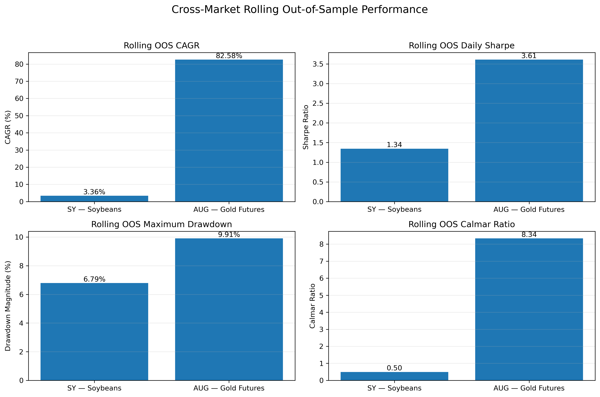
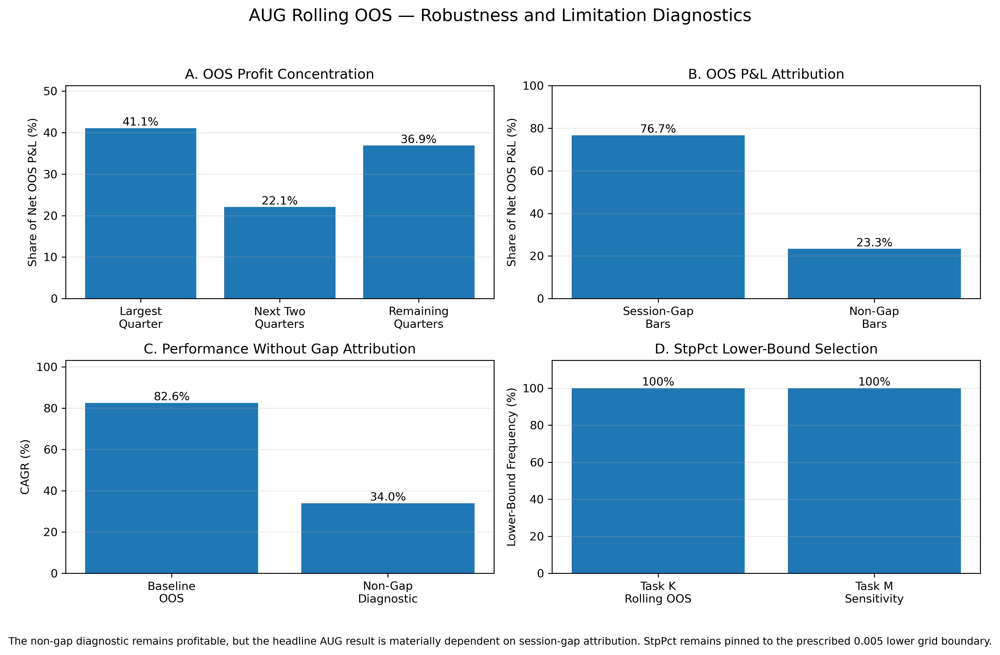

# Multi-Market Trend-Following Strategy with Walk-Forward Optimization

A quantitative research project evaluating the **out-of-sample performance and robustness of a channel-breakout trend-following strategy across futures markets**.

The project combines statistical price diagnostics, transaction-cost-aware backtesting, exhaustive parameter optimization, rolling walk-forward validation, sensitivity analysis, cross-market replication, and robustness diagnostics.

The research focuses on **CBOT Soybeans (SY)** as the primary market and **SHFE Gold Futures (AUG)** as the secondary-market replication.

---

## Project Overview

This project investigates whether a systematic channel-breakout strategy can identify persistent futures price trends and retain its performance outside the sample used for parameter estimation.

The analysis addresses four questions:

1. Do futures prices exhibit statistically detectable departures from random-walk behavior?
2. Can a channel-breakout strategy exploit longer-horizon price persistence after transaction costs?
3. How much strategy performance survives under strict rolling out-of-sample evaluation?
4. Are the results robust across markets, estimation windows, and additional diagnostic tests?

The baseline validation framework uses a **4-year in-sample / 3-month out-of-sample rolling design**, with parameters re-optimized before each OOS period.

---

## Markets and Data

| Role | Market | Exchange | Frequency | Available History |
|---|---|---|---|---|
| Primary | CBOT Soybeans (SY) | CME / CBOT | 5-minute OHLC | Jul 1982 – Apr 2026 |
| Secondary | SHFE Gold Futures (AUG) | SHFE | 5-minute OHLC | May 2018 – Apr 2026 |

The finalized datasets contain approximately:

- **495,740 SY observations**
- **138,744 AUG observations**

Preprocessing includes timestamp validation, duplicate detection, missing-value checks, OHLC consistency checks, price validation, and trading-session diagnostics.

---

## Research Pipeline

```text
Market Analysis
      ↓
Data Validation & Preprocessing
      ↓
Random-Walk / Price-Dynamics Tests
      ↓
Strategy Engine Implementation
      ↓
Exhaustive Parameter Optimization
      ↓
Rolling Walk-Forward OOS Testing
      ↓
Full-Sample Hindsight Benchmark
      ↓
Window Sensitivity Analysis
      ↓
Cross-Market Replication
      ↓
Robustness & Limitation Diagnostics
```

---

## Methodology

### 1. Statistical Price Diagnostics

Before implementing the strategy, the project examines whether the underlying price series exhibit departures from random-walk behavior.

Two approaches are used:

- **Lo–MacKinlay heteroskedasticity-robust Variance Ratio tests**
- **Push-Response analysis**

For SY, statistically significant variance ratios below one appear at several short-to-intermediate horizons, with the strongest evidence around approximately **20–80 minutes**, consistent with short-horizon mean reversion.

Push-response diagnostics reveal asymmetric short-horizon behavior: SY exhibits stronger reversal, particularly following positive shocks, while AUG shows more continuation-like behavior.

These findings do not necessarily contradict longer-horizon trend following because the trading strategy operates over substantially longer channel horizons.

### 2. Strategy Engine

The trading system follows a **Channel WithDDControl** trend-following framework with:

- prior-bar rolling high/low breakout channels;
- long and short positions;
- channel reversals;
- trailing drawdown-control stops;
- futures point-value conversion;
- transaction-cost/slippage accounting;
- bar-level P&L and position tracking;
- trade-level attribution;
- cumulative equity and drawdown tracking.

Current-bar information is excluded from the channel used to generate the corresponding breakout signal, preventing look-ahead bias in channel construction.

The strategy is validated through accounting reconciliation and consistency checks between the optimization and path-based backtesting engines.

### 3. Exhaustive Parameter Optimization

Two strategy parameters are optimized:

| Parameter | Range | Step |
|---|---:|---:|
| `ChnLen` | 500 – 10,000 bars | 10 |
| `StpPct` | 0.005 – 0.100 | 0.001 |

This produces:

**951 × 96 = 91,296 parameter combinations per optimization window.**

The optimization objective is:

> **Net Profit / |Maximum Drawdown|**

The complete parameter grid is evaluated for every optimization window rather than approximated through random or Bayesian search.

Optimized rolling-channel construction and parallelized stop-parameter evaluation are used to make repeated full-grid optimization computationally feasible.

### 4. Rolling Walk-Forward Validation

The baseline framework uses:

- **4 years in-sample**
- **3 months out-of-sample**
- quarterly re-optimization
- **91,296 parameter combinations per IS window**

For each OOS quarter:

1. parameters are selected using only the preceding in-sample window;
2. the selected parameters are applied to the following OOS period;
3. only OOS P&L is retained for performance evaluation;
4. OOS P&L is stitched chronologically into a continuous equity curve.

The main analysis uses an **IS-conditioned OOS implementation**, allowing strategy state entering each OOS period to be generated from its corresponding historical in-sample path while preventing future parameter information from entering the optimization.

---

## Rolling Out-of-Sample Results

| Metric | CBOT Soybeans (SY) | SHFE Gold (AUG) |
|---|---:|---:|
| Initial Equity | 100,000 | 100,000 |
| Ending Equity | 372,260.74 | 955,221.26 |
| Net Profit | 272,260.74 | 855,221.26 |
| CAGR | **3.36%** | **82.58%** |
| Maximum Drawdown | **-6.79%** | **-9.91%** |
| Daily Sharpe Ratio | **1.345** | **3.609** |
| Calmar Ratio | **0.495** | **8.336** |

Because SY and AUG cover different historical periods and have different contract economics and market structures, these results are presented as a **cross-market robustness comparison rather than a direct performance ranking**.



---

## Primary Market — CBOT Soybeans

The finalized SY rolling walk-forward experiment contains:

- **159 OOS quarters**
- approximately **449,885 OOS bars**
- **2,101 completed OOS trades**
- **108 positive, 44 negative, and 7 flat quarters**

Key OOS statistics:

| Metric | Result |
|---|---:|
| CAGR | **3.36%** |
| Daily Sharpe | **1.345** |
| Maximum Drawdown | **-6.79%** |
| Calmar | **0.495** |
| Profit Factor | **1.974** |
| Trade Win Rate | **43.65%** |

The strategy retains a positive historical edge after repeated parameter re-estimation, transaction costs, and rolling OOS evaluation.

A separate full-history optimization is used only as a **hindsight in-sample benchmark**. The SY full-sample optimum is `ChnLen = 3810` and `StpPct = 0.009`, with a Daily Sharpe of **1.191** and Calmar of **0.621**.

The OOS trade and risk metrics show no clear collapse relative to the hindsight benchmark, although this is not interpreted as proof that the strategy is free from overfitting.

---

## SY Window Sensitivity

The baseline 4-year / 3-month specification is not selected ex post from the tested alternatives.

Alternative in-sample and OOS horizons are evaluated as robustness checks on an identical common comparison period.

Across the tested SY specifications:

- CAGR: approximately **3.64% – 3.67%**
- Daily Sharpe: approximately **1.34 – 1.45**
- Maximum Drawdown: approximately **-9.18% to -7.04%**
- Calmar: approximately **0.40 – 0.52**

The historical edge therefore does not appear uniquely dependent on the baseline window configuration, although risk measures remain sensitive to the precise specification.

---

## Secondary-Market Replication — SHFE Gold Futures

The research framework is replicated on **SHFE Gold Futures (AUG)** using the same:

- strategy logic;
- optimization objective;
- 91,296-point parameter grid;
- baseline 4-year IS / 3-month OOS framework.

The AUG rolling experiment contains:

- **15 OOS quarters**
- approximately **65,376 OOS bars**
- **173 completed OOS trades**
- **15 / 15 positive OOS quarters**

Key OOS statistics:

| Metric | Result |
|---|---:|
| CAGR | **82.58%** |
| Daily Sharpe | **3.609** |
| Maximum Drawdown | **-9.91%** |
| Calmar | **8.336** |
| Profit Factor | **7.186** |
| Trade Win Rate | **58.38%** |

Because these results are exceptionally strong, the analysis does not interpret the headline performance at face value. Additional diagnostics examine performance concentration, session-gap dependence, parameter stability, and sensitivity to the walk-forward design.

---

## AUG Robustness Diagnostics

### Temporal Concentration

AUG profitability is meaningfully concentrated through time:

- the largest OOS quarter contributes **41.06%** of total net OOS P&L;
- the top three quarters contribute **63.11%**.

This indicates that the headline performance is not evenly distributed across the test period.

### Session-Gap Dependence

Approximately **76.67%** of AUG net OOS P&L is associated with session-gap bars, while approximately **23.33%** is attributed to non-gap bars.

A diagnostic excluding session-gap P&L attribution remains profitable but produces materially weaker performance:

| Metric | Baseline OOS | Non-Gap Diagnostic |
|---|---:|---:|
| CAGR | **82.58%** | **34.00%** |
| Calmar | **8.34** | **2.70** |
| Maximum Drawdown | **-9.91%** | **-12.59%** |

This is a material limitation because the 5-minute dataset does not observe the complete price path occurring inside inter-session gaps.

### Parameter Boundary

The optimized AUG stop parameter repeatedly selects:

`StpPct = 0.005`

the lower boundary of the prescribed parameter grid.

The lower-bound selection frequency is **100%** in both the baseline rolling optimization and the tested AUG sensitivity specifications.

This suggests that the exact stop parameter is not fully identified within the prescribed optimization domain and should be treated as a limitation rather than evidence of parameter stability.



---

## AUG Window Sensitivity

Because AUG has a substantially shorter available history than SY, the feasible sensitivity design uses:

- \(T \in \{4,5,6\}\) years;
- \(\tau \in \{3,6\}\) months.

All six tested specifications remain profitable on the identical common OOS comparison period.

Common-period results span approximately:

| Metric | Range |
|---|---:|
| CAGR | **167.68% – 183.05%** |
| Daily Sharpe | **3.98 – 4.30** |
| Maximum Drawdown | **-14.14%** |
| Calmar | **11.86 – 12.94** |

The results show limited sensitivity to the tested window specifications.

However, AUG's shorter history and the small number of OOS windows—particularly for the longest estimation windows—limit the strength of the inference.

---

## Key Findings

1. **Price dynamics are horizon-dependent.**  
   Short-horizon mean reversion can coexist with profitable longer-horizon breakout behavior.

2. **SY retains a positive historical edge under rolling OOS evaluation.**  
   The strategy remains profitable after repeated parameter re-estimation and prescribed transaction costs.

3. **The framework transfers across markets.**  
   Applying the same research framework to AUG produces strong historical rolling OOS performance.

4. **Strong headline performance requires additional scrutiny.**  
   AUG results are materially affected by temporal concentration, session-gap attribution, and persistent lower-bound stop selection.

5. **Full-sample optimization is treated only as a hindsight benchmark.**  
   It is not presented as a competing OOS strategy.

6. **Robustness is evaluated beyond the equity curve.**  
   The project incorporates window sensitivity, trade-level accounting, performance concentration, cross-market replication, and data-path diagnostics.

---

## Repository Structure

```text
.
├── README.md
├── requirements.txt
├── .gitignore
│
├── data/
│
├── notebooks/
│   ├── 01_market_analysis.ipynb
│   ├── 02_data_preprocessing.ipynb
│   ├── 03_random_walk_tests.ipynb
│   ├── 04_strategy_engine.ipynb
│   ├── 05_sy_walk_forward_optimization.ipynb
│   ├── 06_sy_full_sample_optimization.ipynb
│   ├── 07_sy_oos_vs_insample.ipynb
│   ├── 08_sy_window_sensitivity.ipynb
│   ├── 09_aug_walk_forward_optimization.ipynb
│   ├── 10_aug_full_sample_optimization.ipynb
│   ├── 11_aug_window_sensitivity.ipynb
│   ├── 12_aug_robustness_assessment.ipynb
│   ├── 13_aug_procedure_comparison.ipynb
│   └── 14_project_summary_figures.ipynb
│
├── Output/
│   ├── figures/
│   │   ├── cross_market_oos_comparison.png
│   │   └── aug_robustness_diagnostics.png
│   └── result/
│
└── reference/
    ├── main.m
    └── ezread.m
```

The notebooks form a sequential research pipeline:

- **01–04:** market analysis, data validation, statistical testing, and shared strategy implementation;
- **05–08:** primary-market research on CBOT Soybeans;
- **09–13:** secondary-market replication and robustness analysis on SHFE Gold Futures;
- **14:** project-level summary figures.

---

## Reproducibility

The project is implemented primarily in Python.

Core libraries include:

- NumPy
- pandas
- Matplotlib
- SciPy
- Numba
- PyArrow

Install the required dependencies with:

```bash
pip install -r requirements.txt
```

Then launch Jupyter:

```bash
jupyter lab
```

The notebooks are designed to be read in numerical order. Data preprocessing should be completed before downstream statistical tests and strategy experiments.

Generated analytical outputs are stored under:

```text
Output/result/
```

Project-level figures are stored under:

```text
Output/figures/
```

---

## Data Availability

The project uses 5-minute futures OHLC data.

Depending on licensing or redistribution restrictions associated with the original data source, raw market data may not be suitable for public redistribution.

The repository therefore separates source data, analysis notebooks, and generated outputs so that the methodology and research results can be reviewed independently of raw-data redistribution.

---

## Reference Code

The `reference/` directory contains the original MATLAB implementation used as a strategy-logic reference.

It is retained to document the baseline trading rules and support validation of the Python strategy implementation.

The Python backtesting framework, exhaustive optimization, rolling walk-forward evaluation, sensitivity analysis, cross-market replication, and robustness diagnostics are implemented in the research notebooks.

---

## Limitations

The results are historical research results and should **not** be interpreted as expected live-trading performance.

Important limitations include:

- historical parameter optimization remains exposed to data-snooping and model-selection risk;
- transaction costs are represented through specified slippage assumptions;
- execution within a 5-minute OHLC bar cannot be fully reconstructed;
- inter-session price paths are not observed in the AUG dataset;
- AUG has a substantially shorter history than SY;
- AUG OOS performance is materially concentrated in a small number of periods;
- a substantial share of AUG P&L is associated with session-gap bars;
- the AUG stop parameter repeatedly reaches the lower optimization boundary;
- market structure and contract economics differ across the two futures markets.

These limitations are reported explicitly because evaluating the credibility of a backtest is a central part of the research process.

---

## Project Background

The initial strategy specification was motivated by coursework in financial price analysis.

The repository was subsequently **independently restructured and substantially extended into a personal quantitative research project**, including Python strategy validation, exhaustive walk-forward optimization, sensitivity analysis, secondary-market replication, trade-level diagnostics, and additional robustness testing.

This repository is maintained as a personal quantitative research project for portfolio and technical-review purposes.
